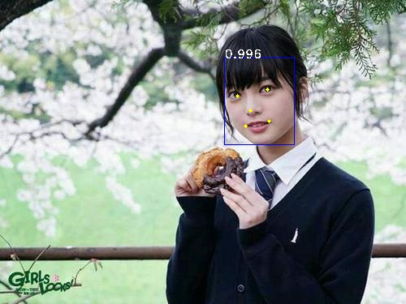

# InsightFace and RetinFace
RetinaFace: Face Detection

InsightFace: Face Recognition

Just use pre-trained weights to predict.

___
## RetinaFace

`predict.py`

```pyt
# #################################################
# This is a example to predict your own image
techi = cv2.imread('./img/techi.jpg')

# cv2.imread is BGR model, change it to RGB
techi = cv2.cvtColor(techi, cv2.COLOR_BGR2RGB)

# get a predictor
predictor = RetinaFace()
# start predicting
predictor.predict(techi)
# #################################################
```



## InsightFace

`recognize.py`

```pyth
img_path = 'img/shu.jpg'
original_img = cv2.imread(img_path)
insight_face = InsightFace()
face_name, _, _, _ = insight_face.recognize(original_img)
print(face_name)
```

## ToDO

* [x] Prediction Part
* [ ] Training Part